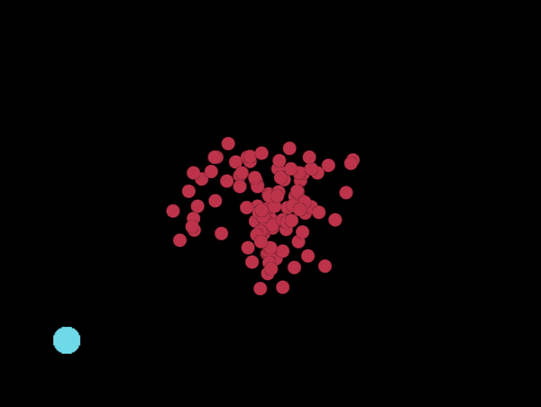

# Collider Ball!

A small game to explore collision and simulation with pyglet.  




To run, clone the repo then run the following:  
```python
> pip install pyglet
> cd collider_ball
> python main.py
```

This project was built with Python 3.8.3, and pyglet 1.5.7.